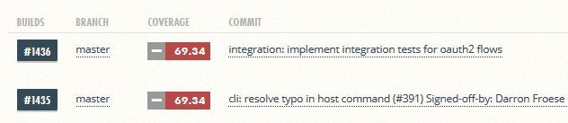
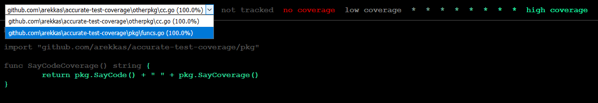

[Go](https://golang.org/), the programming language written and maintained by
[Google](https://www.google.com), shines with it's toolchain. However, some of
the tools behave differently than expected and it may cost you several hours of
debugging and experimenting to find the arguments and execution orders.

This article introduces you to the problem of **reporting accurate code
coverage** using the Go programming language, and offers a solution that runs on
any Operating System. If you have not worked with Code Coverage in Golang,
consider reading the excellent [Go cover story](https://blog.golang.org/cover)
first.

If you are looking for the **solution only, run this:**

```shell
# Download and install go-acc
$ go get -u github.com/ory/go-acc

# Run it against some package(s)
$ go-acc github.com/some/package
$ go-acc .
$ go-acc ./...
$ go-acc $(glide novendor)
```

## The Problem

While writing integration tests for one of our
[open source](https://github.com/ory/) Go projects, I noticed that code coverage
did not increase despite writing a lot of them.



The reason for this was that `go test -cover` is per default only recording code
coverage for the package that is currently tested, not for all the packages from
the project. If you have a lot of integration tests, **your code coverage might
be higher than you think!**

## The Code

First I want to take a look at some code. This repository is available on
[GitHub](https://github.com/arekkas/accurate-test-coverage) . The repository
consist of two packages `pkg` and `otherpkg`. The first package defines two
functions, `SayCode` and `SayCoverage` and a test for `SayCode`. The second
package defines a function `SayCodeCoverage` that uses `SayCode` and
`SayCoverage`, and a test for `SayCodeCoverage`:

```go
// funcs.go
package pkg

func SayCode() string {
    return "code"
}

func SayCoverage() string {
    return "coverage"
}
```

```go
// funcs_test.go
package pkg

import "testing"

func TestSayCode(t *testing.T) {
    if SayCode() != "code" {
        t.Fail()
    }
}
```

```go
// cc.go
package otherpkg

import "github.com/arekkas/accurate-test-coverage/pkg"

func SayCodeCoverage() string {
    return pkg.SayCode() + " " + pkg.SayCoverage()
}
```

```go
// cc_test.go
package otherpkg

import "testing"

func TestSayCodeCoverage(t *testing.T) {
    if SayCodeCoverage() != "code coverage" {
        t.Fail()
    }
}
```

### The `-coverpkg` flag

Let's use `-covermod=atomic` to get a report of how well the tests cover the
code. We expect 100% code coverage because every line is being touched by the
tests:

```shell
$ go get -d -u github.com/arekkas/accurate-test-coverage
$ go test -covermode=atomic \
    github.com/arekkas/accurate-test-coverage/...

ok  github.com/arekkas/accurate-test-coverage/otherpkg  10.115s coverage: 100.0% of statements
ok  github.com/arekkas/accurate-test-coverage/pkg        0.485s coverage:  50.0% of statements
```

That didn't go as expected! Code coverage reports only 75% (100% + 50%) code
coverage. That happens because `go test -covermode` is not collecting coverage
reports on code that doesn't belong to the package currently being tested. Of
course, Go has a flag for that, it's called `-coverpkg`. This flag accepts a
list of packages to consider while computing code coverage:

```shell
$ go test -covermode=atomic \
    -coverpkg $(go list github.com/arekkas/accurate-test-coverage/...) \
    github.com/arekkas/accurate-test-coverage/...


ok  github.com/arekkas/accurate-test-coverage/pkg       22.494s coverage:   0.0% of statements in github.com/arekkas/accurate-test-coverage/otherpkg
ok  github.com/arekkas/accurate-test-coverage/otherpkg  10.398s coverage: 100.0% of statements in github.com/arekkas/accurate-test-coverage/otherpkg
```

Awesome, we received true code coverage!

### `-coverprofile` is incompatible with `-coverpgk`

How about getting some nice code coverage reporting using, for example,
[coveralls.io](https://coveralls.io/) ? Since `go test` supports writing the
coverage report to a file using `-coverprofile`, this should be an easy one:

```shell
$ go test -covermode=atomic \
    -coverprofile=coverage.tmp \
    -coverpkg $(go list github.com/arekkas/accurate-test-coverage/...) \
    github.com/arekkas/accurate-test-coverage/...

cannot use test profile flag with multiple packages
```

<video autoplay muted loop>
  <source src="../../images/articles/code-coverage/tableflip.mp4" type="video/mp4">
  <source src="../../images/articles/code-coverage/tableflip.webm" type="video/webm">
  
</video>

Using the flag `-coverprofile`, `go test` is unable to merge code coverage from
multiple packages into one report. Thus, what needs to be done is loop through
all the packages, and merge the outputs into one. Doing this either requires
some bash magic (which does not work on windows), or `go-acc`:

```shell
# Download and install go-acc
$ go get -u github.com/ory/go-acc

# Run it against some package(s)
$ go-acc github.com/some/package
$ go-acc .
$ go-acc ./...

# You can use your regular toolchain as well:
$ go-acc $(go list ./...)
$ go-acc $(glide novendor)
```

Now, let's run this against the package from above:

```shell
$ go get -d -u github.com/arekkas/accurate-test-coverage/...
$ go-acc github.com/arekkas/accurate-test-coverage/...


ok      github.com/arekkas/accurate-test-coverage/otherpkg  0.082s  coverage: 100.0% of statements in github.com/arekkas/accurate-test-coverage/otherpkg, github.com/arekkas/accurate-test-coverage/pkg
ok      github.com/arekkas/accurate-test-coverage/pkg       0.081s  coverage:  33.3% of statements in github.com/arekkas/accurate-test-coverage/otherpkg, github.com/arekkas/accurate-test-coverage/pkg
```

Running `go tool cover -html=coverage.txt` should open a browser and show that
all code has been touched by the tests:



That's it - thank you for reading!
