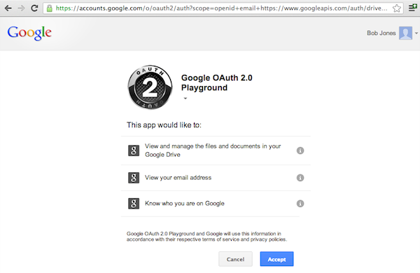

This is the first blog post in a multi-part series about access control on the
web. The goal of this series is to become the go-to guide for anyone that needs
help with setting up access control (authentication & authorization) for their
web application. The following topics will be covered:

- An overview of different access control approaches on the web (this blog
  post).
- A guide to help you choose the right approach for your project including
  implementation best practices.
- An in-depth look at token-centric access control, touching popular topics such
  as OAuth 2.0, OpenID Connect, JSON Web Tokens.
- A comparison of popular permission systems such as Access Control List (ACL),
  Role Based Access Control (RBAC), and advanced policy definition languages.
- Open source software you can use to save yourself a lot of time and money.

If you’re expecting this to be a corporate sales pitch, fear not!
[I](https://twitter.com/_aeneasr) am writing this series because it took me
forever to collect this knowledge from scattered resources across the web (Stack
Overflow, Security Exchange, Google Groups, …), tutorials, or books. I was
especially frustrated by the amount of SEO-optimized content that has the
primary goal of on-boarding you to an expensive Identity SaaS. I sincerely hope
this series is capable of transmitting my knowledge to you. If it isn't, ask me
questions or bash me [on Twitter](https://twitter.com/_aeneasr).

If you wish to be notified when new parts of this series are released
[subscribe to our security newsletter](https://ory.us10.list-manage.com/subscribe?u=ffb1a878e4ec6c0ed312a3480&id=f605a41b53&group[15629][2]=true)
.

## Introduction

Almost every internet-facing application has the concept of users and
permissions, usually summarized as _access control_. Access control has many
facets because it typically represents the access control structure of a
real-world entity (e.g. company). While there is no silver bullet, not
everything has to be reinvented. Yet, developers spend days, weeks, even months
on learning about or coming up with authentication and authorization schemes. In
fact, you _should not_ develop your own systems but use proven & tested (open
source) technology [like the one we build](https://github.com/ory).

### Terminology

You probably have some idea of what access control is already. Our experience
has shown that it’s still helpful to refresh a few terminologies as to avoid
confusion.

- **Authentication**: The process of ascertaining that somebody really is who
  he/she claims to be.
- **Authorization**: The process of verifying access rights and granting or
  denying access in the context of access requests.
- **Access Control**: The selective restriction of access to a place or other
  resource.
- **Auth\* (AuthZ + AuthN)**: Shorthand for Authorization (AuthZ) and
  Authentication (AuthN).
- **Resource Server**: This is a server that provides resources/data to the
  user. This blog post, for example, is rendered by a resource server.

When performing _access control_, web applications typically authenticate the
user, authorize the access request, and finally allow or prevent access to the
requested resource. But authorization does not require authentication, and
neither does authentication require authorization: An anonymous user is not
authenticated, but may still be allowed (authorized) to read a public blog post.
Both concepts are independent but central to security design.

## Types of Access Control on the Web (simplified)

There are numerous ways of restricting access to resources on the web. To give
you a bit of context, we will look at the most common ones. This list is not
exclusive but it gives you an overview of what concepts exist today and why they
evolved.

### Server-Side “Monolithic” Applications

Controlling access to resources in a “monolithic” web application rendered
server-side (Wordpress, Laravel PHP, Symfony, Java Spring MVC, Ruby on Rails, …)
is well-established. Most languages/frameworks come with plug-and-play libraries
that identify users based on a cookie. If the cookie is not set, the user is not
authenticated.

<p>
<figure>
    
    <figcaption>
        User exchanges credentials for a long/short-living session
        cookie which contains information on the user (e.g. the
        user’s ID).
    </figcaption>
</figure>
</p>

Restricting access to the application’s resources usually consists of four
phases:

- The user tries to access a protected resource but no cookie is set. The
  application redirects the browser to the login endpoint.
- The user authenticates by entering his/her credentials (e.g. username +
  password) in the login form hosted by the application. If the credentials
  prove to be correct (this is authentication), the application sends an HTTP
  response containing the `Set-Cookie` header. That header contains a cookie
  which is sent by the browser in subsequent requests to the web application.
  The cookie contains data which is used to identify the user.
- The user accesses the protected resource again. This time, the browser sends
  the session cookie set by the login endpoint.
- The application validates (authenticates) the session cookie. It may
  optionally check if the user has permission to access the protected resource
  (authorization).


Let’s take a short look at some pseudo code (NodeJS for simplicity) that
implements this behaviour at the resource endpoint (not the login endpoint):

```js
app.get(
  '/some-protected-resource',
  auth.hasValidSession,
  auth.hasPermission('canEditContent'),
  function(req, res) {
    // console.log(req.user.email)
  }
)
```

In this case, we are assuming that auth is some type of middleware that allows
us to check if the client (browser) is authenticated (using the session cookie)
and whether or not the authenticated client is allowed to `canEditContent`. With
the express-session middleware you would probably check if a session is set and
if it contains a user:

```js
const auth = {
  hasValidSession: (req, res, next) => {
    if (!req.session.user) {
      res.redirect('/login')
    } else {
      next()
    }
  },
}
```

while the latter `auth.hasPermission('canEditContent')` uses, for example, an
[Access Control List](https://de.wikipedia.org/wiki/Access_Control_List) to
decide if `req.user.email` is allowed to `canEditContent`.

### Client-Side Applications

Client-side applications are typically javascript applications (React, Angular)
running in the browser - sometimes referred to as single page apps (SPA) - or
mobile apps built with Ionic, React Native, Objective C/Swift (iOS) or Java
(Android).

What differentiates these applications from server-side applications is that the
data is not rendered server-side but instead provided in a machine-readable form
through an API (e.g. REST, GraphQL). The API itself is protected either through
the already established cookie mechanism or a substitute (tokens).


Cookie-based authorization is legitimate for SPAs and even encouraged for apps
that run in the browser. Most browsers support cookie flags httpOnly and secure
which tell the browser that the cookie should

- not be readable by the javascript application itself which mitigates XSS
  attacks on your precious cookie credentials by reading from localStorage.
- should only be transmitted when the request is sent via HTTPS, mitigating
  man-in-the-middle attacks.

Most native mobile apps (without WebView) however use token-based authorization.
Reasons vary but it usually revolves around complexity. Developers typically opt
for:

1.  Show a login form to the user.
2.  Send the credentials to an API.
3.  The API returns a token on success.
4.  The app stores that token locally and uses it on consecutive requests.

Implementing this flow with cookies looks similar, but additionally involves
parsing of different cookie flags ( _secure, Max-Age, domain..._) which is added
complexity most developers like to avoid. Some third-party libraries do not
event support cookies and force you to use tokens or API keys.

To include a token in an HTTP request, it’s usually added to the HTTP
Authorization Header:

```
GET /protected-resource HTTP/1.1
Host: foobar.com
Authorization: bearer <some-token>
```

There are two distinct token formats: pass-by-reference and pass-by-value. For
now we will just stick with a random ID (e.g. abcde) and talk about the
different token types later in this series.

Let’s revisit the same flow but this time with a smartphone as a client (not a
browser) and a token instead of a cookie:


Looks pretty much the same, right? Well, it is. Instead of sending the cookie in
the HTTP header ( `Cookie: ...` ), we are now sending the token in the HTTP
header ( `Authorization: bearer abcde` ).

There is no real winner in the cookie versus token debate. Cookies can be a very
good choice for browser-based applications because browsers deal with the
complexity of storage and security. But cookies also require CORS to be properly
configured, make
[CSRF attacks](<https://www.owasp.org/index.php/Cross-Site_Request_Forgery_(CSRF)_Prevention_Cheat_Sheet>)
easier, and do not work cross-domain.

In conclusion, both approaches, token and cookies, have their advantages and
disadvantages. Native mobile apps usually avoid cookies while browser apps lean
towards cookies. And that’s also my recommendations if you have to make this
decision right now.

### Server-Side Distributed Applications

As your team or company grows, you eventually add more services and applications
to your infrastructure. Sometimes people talk about microservices or
service-oriented architecture when referring to this.


Let’s take a look at how access control works in such an environment. If we
assume the infrastructure from before, each service would have its own
authentication and authorization system. The client (browser) would authenticate
at each service individually and receive a cookie (or token). This is bad for
several reasons:

1.  Most users do not use passwords managers and instead reuse their credentials
    at each service. This would allow a developer of service A to eavesdrop on
    the credentials in the login screen and use those to log into services B and
    C, impersonating the user. This is extremely dangerous in very sensitive
    systems.
2.  The user administration is cumbersome as a user has to be managed on each
    service individually.
3.  Your users will eventually complain that they have multiple user accounts
    for what they perceive as one system.

The obvious solution to this is to introduce another service which is
responsible for managing users and exchanging usernames and passwords for
temporary credentials. This is usually called Single Sign-On (SSO).

<p>
<figure>
    
    <figcaption>Simplified Single Sign-On</figcaption>
</figure>
</p>

The SSO service is responsible for user management (signup, banning, removing,
updating profile pictures, …) and is also capable of logging people in. Onl the
SSO has access to the highly privileged and long-living user credentials
(username + password). Instead of submitting the password to each service - and
thus potentially enabling malicious developers or hackers to eavesdrop - only
one fortified service (SSO) has access to them.

Once the user is authenticated, the SSO service can either issue a token
(sometimes also called assertion) or set a cookie for the whole domain. The SSO
service may scope (“limit”) the access rights of the token/cookie - for example,
it might only be valid for the blog service.

While setting a domain-wide cookie is a valid practice for an SSO service, most
issue tokens which are sent on every request by the client:

<p>
<figure>
    
    <figcaption>
        A variety of clients accessing the service ecosystem.
    </figcaption>
</figure>
</p>

Most SSO products (open source & SaaS) implement open auth\* protocols like
SAML, OAuth 2.0, or OpenID Connect to ship this feature in an interoperable way.

[ORY Hydra](https://github.com/ory/hydra) is an open source product which
implements the OAuth 2.0 and OpenID Connect protocols. You should check it out
if you are looking for cloud-native, scalable and battle-tested authorization
server.

## Browsers, Smart Homes, Smartphones, ...

Today, most applications serve a variety of clients, from smart homes to browser
apps, to native apps, to 3rd party developers. Here is where cookies are no
longer viable for API access control. Instead, these systems rely on
well-established and peer-reviewed protocols such as OAuth 2.0. These protocols
use token-based authorization only.

Especially when sharing access to APIs with 3rd party developers, you need to
make sure that users actually want their data exposed to these 3rd parties. This
is what specifically OAuth 2.0 was made for:



We will leave it at that for now. OAuth 2.0 and OpenID Connect have steep
learning curves, so we will be looking at those in detail in a later part of
this series!

## Conclusion

Now you have a high-level overview of the different auth\* environments that
exist today. This knowledge will help you significantly in understanding the
blog posts coming up in the next weeks. Please note that we did not touch topics
like Kerberos or SAML. These systems are totally legitimate but tend to be found
in enterprise and/or legacy systems only. If you want a blog post about this,
let me [know on twitter](https://twitter.com/_aeneasr)!

Also, I’d like to invite you to check out
[our open source products on GitHub](https://github.com/ory/) . If you are
interested in this topic, you will probably find a product that you can use!

If you wish to be notified when new parts of this series are released subscribe
to
[our security newsletter now](https://ory.us10.list-manage.com/subscribe?u=ffb1a878e4ec6c0ed312a3480&id=f605a41b53&group[15629][2]=true)!

## Consulting

You have an urgent project coming up and need some advice with designing a
secure system? We’re here to help - just drop us a line at
[hi@ory.sh](mailto:hi@ory.sh).
